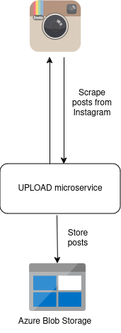
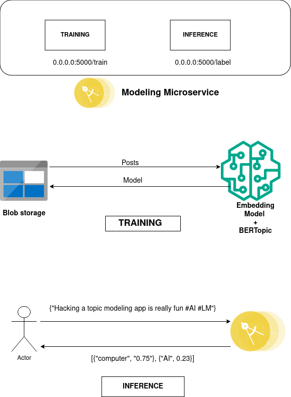

# Topic modeling of Instagram posts

## Run
To run the application locally, please follow the steps below:

Step 1:  Execute from root directory of project

`$ flask run`

Step 2: Infer the topic of an instagram post

`$ curl -X POST -H "Content-Type: application/json" -d '{"text": "Hacking a topic modeling app is really fun #AI #LM"}' http://127.0.0.1:5000/label`

<mark style="background-color: " >**NOTE**</mark>  
Before running the app -
1. Please configure the Azure connection details within the code.
2. Train the model **once** before doing inference.
3. Make sure the training data exists inside the blob storage.

## Architecture

As a first step in modeling instagram posts we need to create a **Upload** microservice which scrapes posts from instagram and stores it onto Azure Blob Storage. __Implementation of this microservice is out of scope for this task__. 

Below we graphically explain the architecure behind the Modeling microservice which is responsible for training and inference on Instagram posts on a topical level. The 2 main modules (`train` and `inference`) are available through `/train` and `/label` REST API endpoints. 

We decided on using the `BERTopic` for modeling the topics of instagram posts. https://maartengr.github.io/BERTopic/index.html

## Deployment

We use **docker** to containerize our microservice which is then pushed onto **Azure container registry** from where it is deployed using **Azure App service/Azure Kubernetes Service** and monitored using **K9s**. We have added a dummy docker file which can be modified accordingly. __The implementation of this is out of scope for this task__. 

## Future work

- Gather labels for topics generated on posts and fine-tune the model using:
    - Manual approach: https://maartengr.github.io/BERTopic/getting_started/manual/manual.html

    - Semi supervised approach: https://maartengr.github.io/BERTopic/getting_started/semisupervised/semisupervised.html
- Experiment with other embedding models to improve model efficiency
    https://maartengr.github.io/BERTopic/getting_started/embeddings/embeddings.html

- Compare other Topic modeling models like **NMF**, **LDA** and **Top2Vec** among others.

